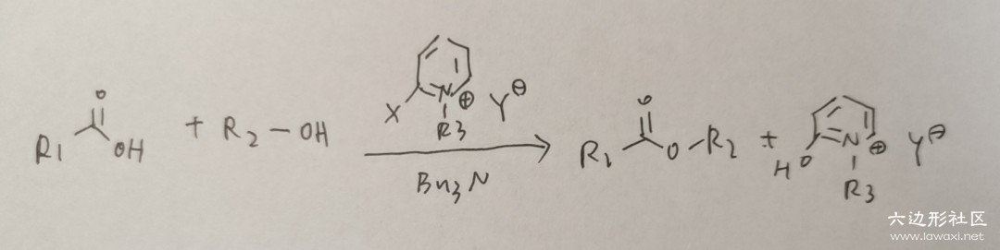

# Mukaiyama Reagent 酯化和酰胺生成的催化剂

有趣的人名反应讲解第1篇：向山试剂（Mukaiyama Reagent）
这个反应是本人非常喜欢的一个反应，设计的十分巧妙，体现了大有机化学的精华啊。
我是真的非常喜欢这个反应，每一步都有每一步正向发生的解释，十分的恰当，大家一定要看完啊。

我们在高中就学习过酯化反应，您还记得酯化反应的条件吗？
是浓硫酸加热+可逆号，这其实是非常苛刻的，别提在高分子上使用，就是普通的小分子反应也基本不会用这种方法。

Mukaiyama Reagent提供了一个简便的办法，我们首先来看规律图：
（我的电脑内存突然不够，截图都不能截了啊，只好手写拍照上传了，十分抱歉）

Mukaiyama Reagent是邻位带卤原子的吡啶盐，在反应中做催化剂（或者说是牺牲剂）。
还需要一个碱做引发剂，使用弱碱NBu3即可。我们具体举一个离子来看看这个反应的机理：

为了讲解方便，我将每一步反应都标了序号，下面来分序号讲解：

①典型的芳香亲核取代反应（SNAr）。由于是亲核取代反应，芳香分子的亲电性越高越容易反应，Mukaiyama大佬直接选用了带正形式电核的吡啶离子，强烈地吸电子，导致第一步反应迅速发生。

②在第一步结束后，吡啶离子加入整个分子中，失去了芳香性，显然此处要通过脱去溴以恢复芳香性。综合以上两步，其实就是发生SNAr反应后脱去一个溴原子，我认为不妥当，溴原子作为卤素有亲电性，当然如果没有氮，这个反应也可以发生；但是在此处，显然是带正电的氮相比于溴原子发挥了更重要的作用，我认为第一步反应是速决步，第二步反应只是追求稳定性的一次再修正，并不决定反应速率。

③下一步是典型的羰基加成思路，是羰基碳两侧基团与一个第三方基团的交换，达到更稳定的效果。即醇上的氧原子取代了羰基右侧的基团。我们知道一般的酯化反应就是这一步最拖延速率，导致整个体系一塌糊涂，选用Mukaiyama试剂也正是追求这一步的速率之快，其主要原因就是右侧基团作为一个中性分子的离去性实在太好了。

④离去后Mukaiyama试剂通过进一步水解恢复芳香性，这一步实际上是可逆的，是芳香性的稳定性与有机体系下极性分子（正负电荷分散）的不稳定性之间的竞争。《Name Reactions》中的反应通式所写的最终产物是中性的左侧分子而不是带有芳香性的右侧分子，而反应例子中写了可逆的转变，这并不需要特别在意。Mukaiyama试剂在反应结束后也香消玉殒，让我们感谢Mukaiyama试剂通过牺牲自己加速了酯化反应，也许作为催化剂，它的使命只是完成任务并且全身而退，但Mukaiyama试剂不仅于此，它不仅催化了反应，还无私奉献了自己，不拿群众一针一线，这是社会主义的催化剂啊！

这个反应除了用作酯化反应，还可用于酰胺生成，因为氮原子进攻相比于醇上的氧原子进攻，效果是更强的，酰胺生成甚至可以被应用于已经形成了的高分子上。大家有兴趣可以在《Name Reactions》上找到对Mukaiyama试剂的具体讲解。

------

投稿地址：http://www.lawaxi.net/d/18

投稿日期：2020-06-07

收录日期：2020-08-02

引用本文：[1]Delay;Creator Chemical Lett.,2020,001.