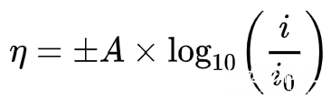

# 超电势 Overpotential

## 介绍

对于一个电化学装置，我们可以通过热力学计算（法拉第定律...）的方法得到电动势（E），同样可以通过实际测量电池两端输出或输入电压获得路端电压（U）。在原电池中，路端电压往往会比电动势小；在电解池中，路端电压往往大于电动势；这些额外的能量转换成了热量而散失。这两者有区别的原因在于，电池电压的影响因素不仅仅是热力学的电势差/转移电子数，还包含一些其他的动力学因素甚至物理因素，我们笼统地用“超电势Overpotential（η）”来讨论。

> In electrochemistry, overpotential is the potential difference (voltage) between a half-reaction's thermodynamically determined reduction potential and the potential at which the redox event is experimentally observed.
> —— Wikipedia: Overpotential

## 表现

1.氢气在汞阴极表面析出有动力学阻碍，而铂甚至铁都容易析氢。利用这一特点，用汞电解氯化钠溶液可以制得钠单质。（由于钠和水反应析氢，有动力学阻碍；又因为钠与汞结合形成合金，及时隔离开水体系）

2.电解氯化钠水溶液时，氯离子被氧化为氯气，而不是水分子被氧化为氧气。实际上，前者的半反应EΘ=1.36V，后者半反应EΘ=1.23V。根据热力学理论，相同浓度下应该是水更容易被氧化，况且是在氧多的情况下。实验中的反常表现，是由于电极表面有Bubble overpotential，使失电子形成气体很不顺畅，由于氯离子氧化和水分子氧化所失去的电子比例为1：2，因此氯气析出相较于氧气显得稍微容易。

## 数值

在没有电流通过时，电化学装置处于平衡状态，内部反应可逆，此时两端电极电势称为平衡电极电势；当有电流通过时，电极电势偏移平衡电极电势，这种现象称为“电极极化”。超电势的概念就是定义在电极极化上的。超电势产生条件大概分为以下几种（维基百科上摘录的，我个人认为好像没什么用？）：

> - 电解池的阳极更正，消耗的能量超过热力学所需的能量。
> - 电解池的阴极更负，消耗的能量超过热力学所需的能量。
> - 原电池的阳极不那么负，释放的能量比热力学上的少。
> - 原电池的阴极不那么正，比热力学上提供的能量更少。

当然，按照以上概念，当电流密度（ current density，单位A/m2）增大时，偏离可逆状态越远，电极极化加深，超电势大。因此可以将超电势随电流密度增大而增大的规律总结为经验公式（电催化析氢研究很透彻，这两个公式都是专门计算析氢的，其他反应暂不了解是否有方程）：Bulter-Volmer方程，和其改进版Tafel方程。A为常数Tafel slope.

Tafel方程相比于Bulter-Volmer方程稍显精准，但作为经验公式，它们的计算结果和实际测量还是相差较远。这是由于在电化学装置反应过程中，每一个步骤都会引发多种形式的超电势，我们所总结的η是这些超电势的总和。不仅仅受电流密度影响，对于一个相同的反应，甚至是操作条件都会对超电势有影响。超电势的分类如下。

## 分类

（超电势的本质是电极极化，这些分类的英文名称是XX Overpotential，但中文是XX极化，不要怀疑）

1.浓差极化 Concentration overpotential

溶液中各处的浓度有差别，扩散缓慢，导致了很多电能以热量散失，这就是浓差极化。可能造成的原因有，电子导体中电子浓度较高，与离子浓度不适配；电化学装置运行一段时间后，携带电荷的两种离子浓度减小，尤其是当它们比溶液本体浓度更小时，超电势十分明显。前文氯气和氧气谁先析出，由于Bubble overpotential，是浓差极化的一个细分。气体分子在溢出时会在电极表面形成气泡（Bubble），使电极与溶液接触面积减小，导致了局部电流密度增大，使得超电势增大。

电解过程中气泡附着在电极上，图源：https://www.bilibili.com/video/BV17x411M7uD

2.电化学极化 Reaction overpotential（或称活化超电势 Activation overpotential）

电化学超电势是由反应的活化能引起的超电势现象，我们考虑△G，只考虑了反应的热力学有利，而没有考虑动力学上是否可以反应。当考虑到活化能时，这也是为什么氢气容易在有催化效果的铂电极上析出，而对于没有这种能力的锌、汞电极都不能有效地析出（称之为动力学阻碍）。在电化学反应中，为什么选用铂电极，一是为了它的电化学惰性，二是贪图它对超电势的削弱，这是热力学和动力学共同的决定。

3.有争议的：电阻超电势 Resistance overpotential

这种超电势不是由于电极极化引起的，而是由于电路或电池的设计和物理属性产生的。例如电池内阻，电极与溶液间的junction overpotential，离子吸附在电级上形成bilayer（是电容）。在Wikipedia上，这一项列入超电势；而在国内教材或文献中，这一项单列出来，属于影响电动势与路端电压的另一因素。

参考

1.Wikipedia: https://en.wikipedia.org/wiki/Overpotential
2.Wikipedia: https://en.wikipedia.org/wiki/Tafel_equation
3.雷越,黄春华,冯振华,荆延,陈飞武,王桂华.电极表面超电势Tafel公式的推广[J].大学化学,2013,28(06):62-65.
4.尤蕾蕾,潘志刚.有关电解的概念及原理[J].化学教学,2010(10):1-5.

------

投稿地址：http://www.lawaxi.net/d/23

投稿日期：2020-06-08

收录日期：2020-08-02

引用本文：[1]Delay;Creator Chemical Lett.,2020,002.