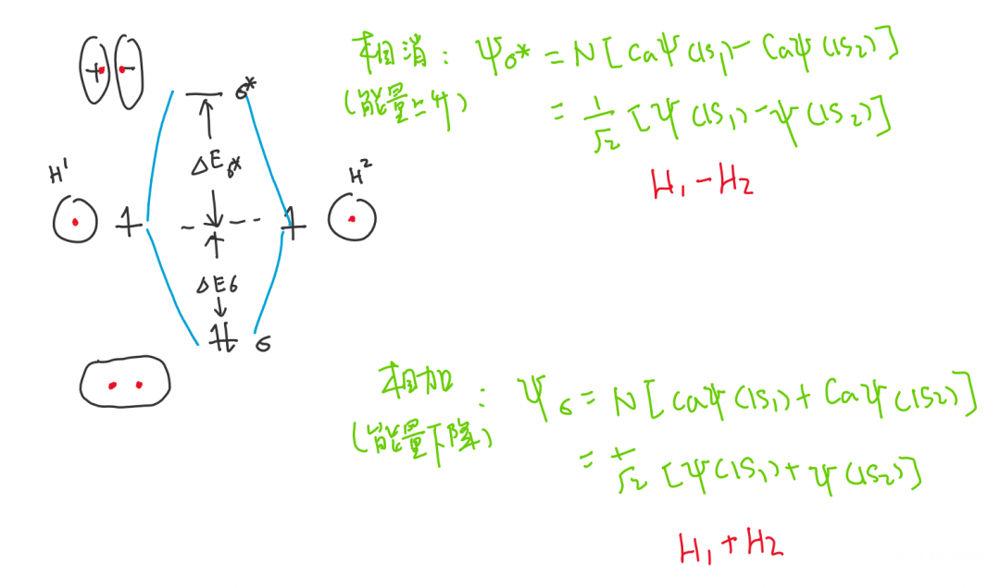
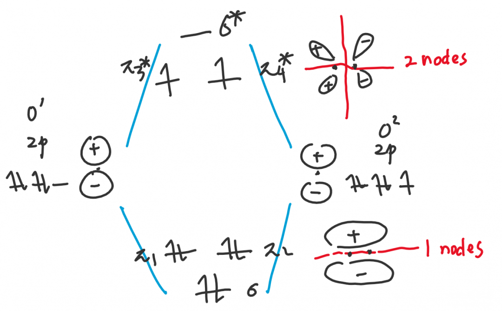
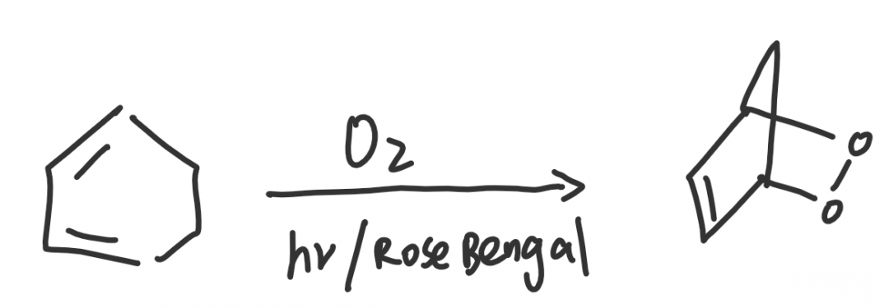
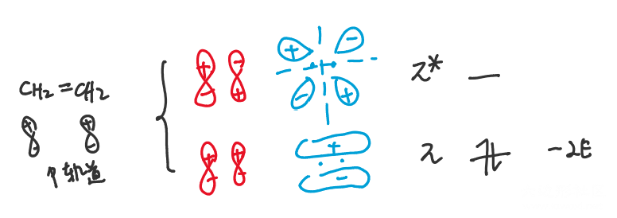
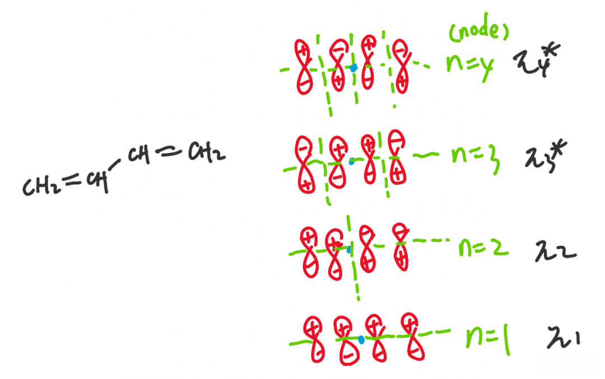

# 分子轨道理论MO在有机化学中的应用（上）

## 分子轨道理论

分子轨道（Molecular Orbital）理论是现代共价键理论之一，区别于杂化轨道理论研究原子中电子的杂化，分子轨道理论主要研究分子中原子的杂化（成键）。在杂化轨道理论中，化学家假想每一个原子或者说每一根键都是孤立的（定域的），这造成了很多问题，例如苯分子或共轭二烯的离域键，都无法直接解释，Pauling引入的“共振”概念其实是针对这些不足的打补丁；但这些现象在分子轨道理论中的解释却可以天然地全面。到如今，杂化轨道理论经过不断完善，也是成熟的共价键理论了，甚至也可以被用于理论计算；但在普通化学中，我们介绍的杂化轨道理论层次很浅，因此使用分子轨道理论解释共价键是一个很好的方法。

虽然本文主要讲解分子轨道理论在有机化学上的应用，但我认为还是应该先温习一下分子轨道理论（指在无机或者说结构层面）。氢原子成H-H键时分子轨道：

两个氢原子的轨道相加或相减，分别形成了一个σ成键轨道和一个σ*反键轨道。成键轨道中电子集中分布于原子核之间，能量很低；而在反键轨道中（图中正负表示相位相反，亦可颠倒顺序；概率密度为|ψ|²，因此电子密度相同），电子集中分布于原子核两侧，在原子核中间的位置，没有电子分布，形成波节node.分子轨道理论中常常通过波节比较分子轨道的稳定性，原子核之间的位置是成键效果最好的位置，最稳定，但有了波节这个好位置就不能填充电子了，因此波节越多说明轨道能量越高，不稳定；进一步讨论，每次原子轨道的相加都意味着一次能量的降低，而相消意味着一次能量的升高。

原子间杂化时（杂化轨道是电子的杂化，分子轨道是原子的杂化，我这边说杂化应该也没啥问题），轨道也遵守能量或数量的守恒，因此在本例子中，σ和σ*与原轨道的能量差值△E互为相反数。（对待复杂分子，轨道相加和相消时降低或上升的能量也近似相等，在粗糙的有机化学上常常使用这一特点，用直接“计算”的方法解释稳定性或者判断选择性。）H-H杂化时有两个电子，杂化后都填入了最低能量的σ成键轨道，能量成功降低。

------

在国内外89.3%~~（要素）~~的教材都是通过氧分子的顺磁性引入分子轨道理论的。氧原子的2s电子占满了成键与反键轨道，相抵消，即没有成键，没有什么意义；我这里只画了两个氧原子2p轨道的杂化情况：

根据上面有关H-H杂化的详细解释，大家不难理解氧原子2p轨道的成键。在无机中，很少有老师在讲到此处时不会像话痨一样讲，很明显在图上，π₃ *π₄*都有单电子，因此氧气顺磁性，这是杂化轨道理论所不能解释的...blablabla...。但在有机中，我们会提到另一个内容：氧气的单线态¹O₂与三线态³O₂。上图常见的是三线态氧（基态），余下的两个电子成单排列；通过光敏剂的激发，氧气会形成单线态（激发态），余下的两个电子也成自旋相反的电子对。

在有机化学中，非自由基反应通常涉及的都是电子对的迁移，因此当想要通过氧气将过氧链加入有机分子时（氧气的电子对加成到双键上），一定需要通过单线态氧，而三线态氧就做不到了。激发的过程通常随反应一同进行，例如在氧气做“二烯”的D-A反应中，用玫瑰红光敏剂（Rose Bengal）和光照即可顺利进行反应。

## 解释烯烃的共轭

今天有些累，先更新分子轨道对共轭二烯稳定性的解释，有时间再更新周环反应里分子轨道理论对立体选择性的解释。我们直接通过乙烯和1,3-丁二烯的分子轨道，来说明一下有机里面粗糙而更实用的分子轨道表示方法和规定。如下：

学习有机时，一个常见的思路就是要关注具体的位置，不能像无机一样妄想集大成。例如我们在研究普通烯烃和共轭二烯的稳定性，关注的应当是双键中的第二根键，也就是四个π轨道，那么我们索性不把σ轨道画出来。在之前的O=O键中，我们展示了p轨道分别相加或相消的情况，如蓝色表示；图示方法固然值观，但对于复杂分子很难画，因此我们简化成了左侧的红色，即想象中的“杂化前一瞬间的排列方式”。因此判断波节的个数，也就可以直接画一条直线，分割两个区域，看两个区域的相位（正负）是否正好相反即可了，大家自行体会。

这张图展示的是1,3-丁二烯的分子轨道图示，其中绿色虚线是标出的波节。（大家会发现波节是交替排列的）如果说π₁和π₄*大家好理解的话，中间的两个轨道就显得很难理解了：“虽然我通过计算知道你这种排法确实是从上至下越来越稳定的，但画之前你是怎么排出来的呢？”这涉及分子轨道的规律：①中心对称性依次变化（我用蓝色笔表示出了中心，两侧相位的变化依次是中心对称u，反中心对称g，中心对称...的循环）；②波节数按自然数依次上升。

之前我们说过，对于能量高低，我们可以粗略地按相消一次+E，相加一次-E来计算。（非常粗糙，只是数量级相近，帮助我们计算稳定性大小而已）那么普通烯烃两个电子都下降E，如果是孤立二烯烃，则杂化后能量降低4E；共轭二烯烃中，两个电子下降2E，两个电子下降E，因此共轭二烯烃杂化后能量下降6E，显然比普通烯烃更稳定。

解释完了。

------

投稿地址：http://www.lawaxi.net/d/28

投稿日期：2020-06-09

收录日期：2020-08-02

引用本文：[1]Delay;Creator Chemical Lett.,2020,003.