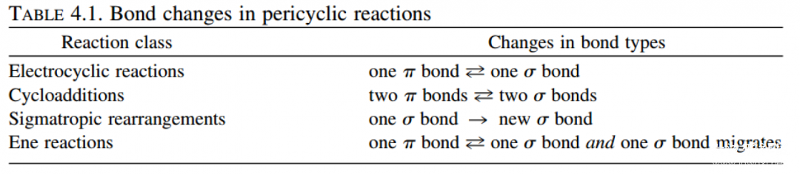
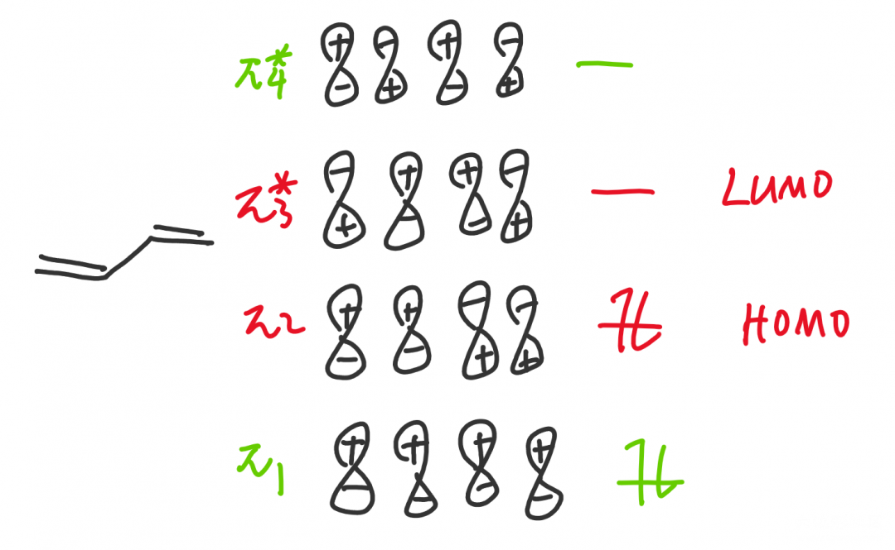
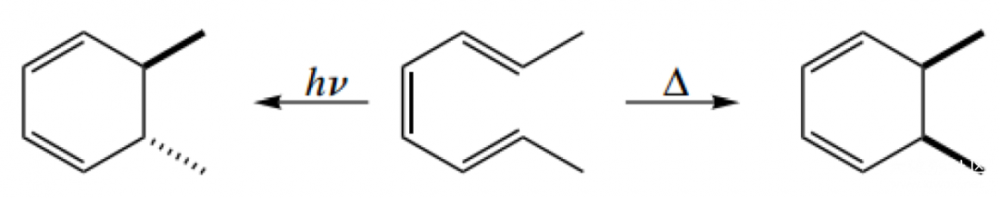
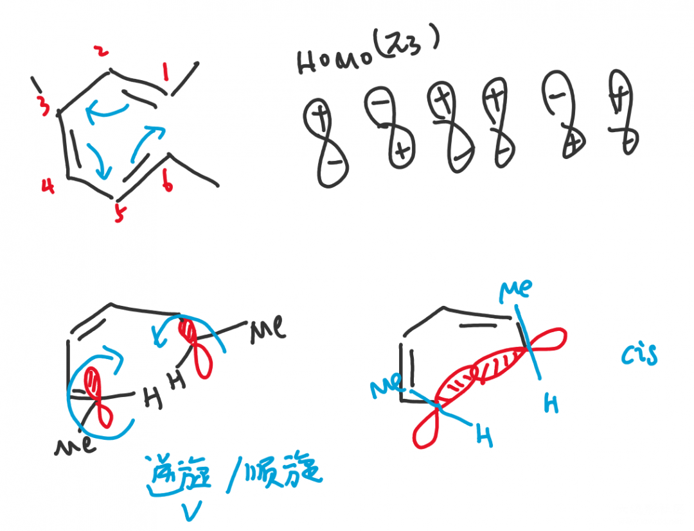

# 分子轨道理论MO在有机化学中的应用（下）

在《上》中，我们介绍了分子轨道理论和如何解释共轭二烯的稳定性的一些问题（引子）；但是在有机化学中，分子轨道理论（前线轨道理论）主要被用于解释周环反应的立体专一性（Stereospecifically）。前人曾经用同样的方法把类似的反应规律都综合到了一个规则中，即Woodward-Hoffman rules，您甚至不需要计算和画分子轨道，直接查表即可获得结论，但这似乎对我们学习并没有好处。

周环反应

周环反应包括电环化、环加成、sigma迁移与烯反应，一般是以五、六元环为中间态，电子在环内按一个方向移动，有时只是双键位置的移动（电环化和sigma迁移），有时会有一根双键和两根单键之间的转化（环加成，烯反应）。具体内容在各种的有机化学教材上都有涉及，环加成可以以D-A反应（Diels-Alder reaction）为例。

四种周环反应特征 图源：《有机机理的书写艺术》

D-A反应图示 图源：《有机人名反应》

D-A反应简略机理

D-A反应中分别在二烯和亲二烯中加入推电子和吸电子基团的目的，就是让二烯中HOMO能量升高，亲二烯中LUMO能量下降，使之匹配以提高反应效率。周环反应都是分子轨道之间的重组，让电子从HOMO中更容易流出和更容易流入LUMO一直都是我们需要考虑的，包括在考虑本文着重讲述的立体专一性上。我们首先来了解HOMO（最高占据分子轨道）和LUMO（最低未占据分子轨道）的概念。

前线轨道理论 Frontier Molecular Orbital Theory（FMO）

前线轨道理论是分子轨道理论的重要衍生。我们从前一章讲过，有机化学研究细节，因此我们显然应当关注电子流入流出的位置，而不是关注所有的分子轨道，这是没有用处的。我们以一个四个碳的体系为例，电子总是从能量高的轨道流出，显然π₂在π₁上面，因此π2电子是最先流出的电子，我们称π₂轨道为最高（电子）占据分子轨道HOMO（Highest Occupied Molecular Orbital）；而电子流入时会流入能量最低的轨道，空着的π₃*与π₄*轨道中，π₃*在下面，是最先接受电子的，我们称π₃*为最低未占据分子轨道LUMO（Lowest Unoccupied Molecular Orbital）。

HOMO和LUMO统称为前线轨道（Frontier Molecular Orbital），是在反应中走在最前面的轨道，其他的轨道用处不明显，在解释问题是亦可不画。在单电子体系中，如自由基反应时，前线轨道的位置只有一个电子，被称为SOMO（Single Occupied Molecular Orbital），电子既可流入又可流出，这时没有HOMO和LUMO的概念，SOMO本身被称为前线轨道。

周环反应的立体专一性

本文主要以《Art》上一个经典的例子讲解这一概念，我们在接下来的环节中只会画出HOMO和LUMO轨道，而不会再考虑其他轨道，如果您思考着不方便，也可以先画出来。

图源：《有机反应机理的书写艺术》

2,4,6-辛三烯在光照（hν)或加热（△）条件下进行电环化，甲基分别处于反式（trans）和顺式（cis）结构。~~这其中是怎么一回事呢？小编也不知道，请朋友们在评论区留下自己的意见吧。~~

六电子体系加热条件，HOMO轨道为π₃，成键时要求相位一致，因此两端的原子需要对旋（disrotatory）转动，随之两个甲基形成顺式结构。在光照条件下，电子被激发，因此HOMO轨道转为π₄*，根据我们上一篇文章讲到的轨道对称性交替排列，π₃和π₄*两个轨道的1，6位相位对称性恰恰相反，最终甲基形成反式结构。

这是Woodward-Hoffman rules的一个具体举例，Woodward-Hoffman rules其实就是按照这种理论归纳成了规律，按照体系中原子的奇偶，是否加热总结了如下的表格：

Woodward-Hoffman rules总结 图源：《有机反应机理的书写艺术》

本文完。

------

投稿地址：http://www.lawaxi.net/d/33

投稿日期：2020-06-10

收录日期：2020-08-02

引用本文：[1]Delay;Creator Chemical Lett.,2020,004.