# 有机化学中的氧化反应

在无机中，化合价升高称作氧化反应；在有机中，**得氧或失氢**称为氧化反应，例如醇→醛/酮→酸（→二氧化碳）。理解起来十分简单，典型的氧化反应也很单一，但人名反应中仍然有不少是氧化反应，这是由于：通常的氧化反应均为“不可书写机理的暴力反应”，而如果想选择性氧化，或者控制氧化速率（例如只把醇氧化到醛），都需要巧妙的设计。

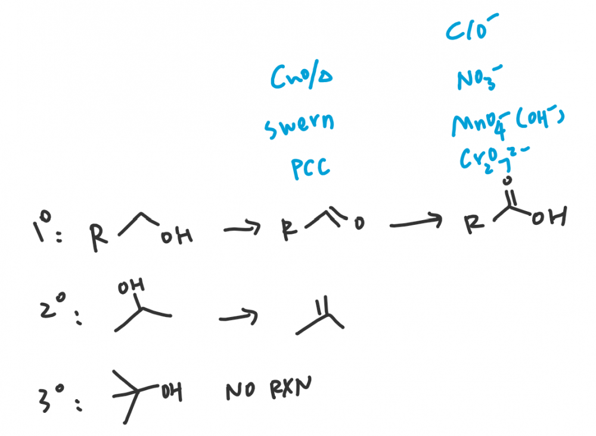

## 梳理方式[[编辑](http://wiki.lawaxi.net/index.php?title=有机:氧化反应&action=edit&section=1)]

在学习时，您可以按照下面的顺序广博地认识。

在梳理和记忆机理时，您可以将它们归纳。**例如如您所见，许多通过消除反应得到双键的氧化反应（醇的氧化）都依靠了离去性好的（正电性）基团，而烯烃加水的氧化反应基本都是通过环加成形成五元环/金属酯，这是很好的思路。**

上面的归类方法就很轻松地区别开了三氧化铬和四氧化锇氧化的不同点，并不需要一个个机理死记。

## 醇的氧化

### Swern氧化

利用氧上带正电基团好的离去性，很轻松地通过消除得到醛。

中间需要一个硫叶立德形成五元环过渡态消除，我暂时没搞懂是为什么，明明NEt3是不错的碱了呀。

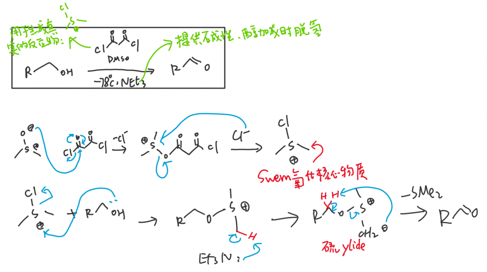

和Swern氧化的机理类似，只不过Swern氧化在硫叶立德的生成上用低温生成中间体试剂的方法，而Moffatt做了改良。

DCC:二环己基碳亚胺

### 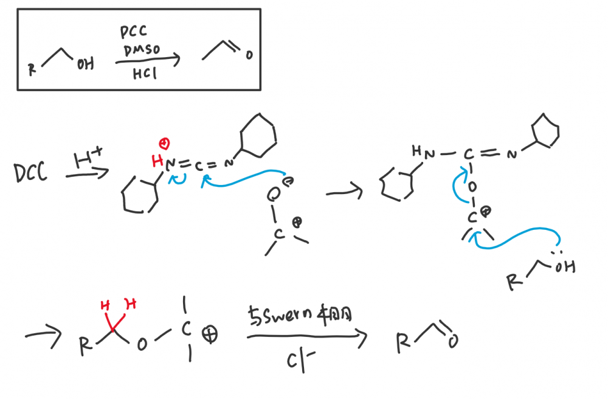

- 

  NCS：N-氯代琥珀酰亚胺

**能提供Cl+的试剂：**次卤酸（盐），NCS：N-氯代琥珀酰亚胺等。

NCS的N在两个羰基的α位，酸性很强，因此相比次氯酸更容易提供Cl+。

**注意：Cl+氧化性强，会直接将一级醇氧化为酸。**

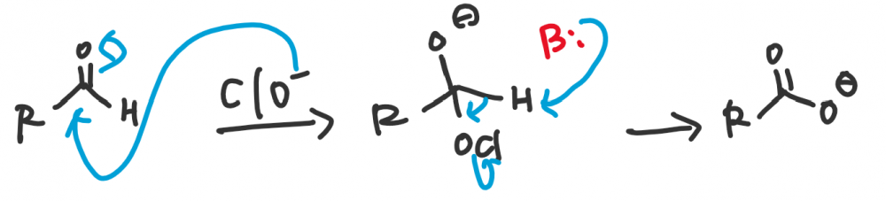

### Cr⁶⁺

氧化剂：三氧化铬（铬酸）/Jones' Reagent（三氧化铬/硫酸中），重铬酸盐。

还原产物：四价铬。

七价钌(Ru)也可以发生类似的反应生成五价钌。

- 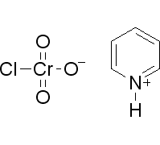

  PCC：氯铬酸吡啶鎓

**注意：Cr⁶⁺氧化性强，会直接将一级醇氧化为酸。**

**使用PCC：氯铬酸吡啶鎓中的Cr⁶⁺活泼性受到了约束，可以使之只氧化到醛**

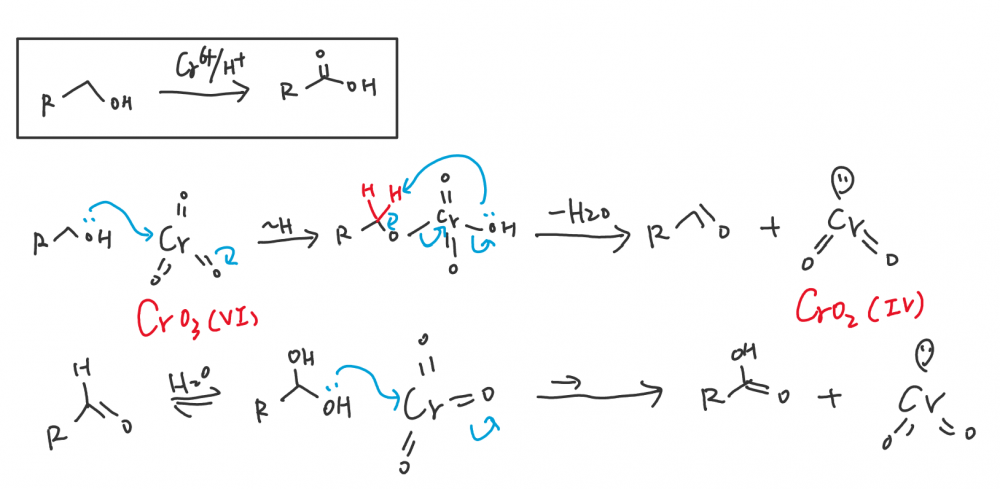

### 碘试剂

PMP试剂是很好用的碘氧化剂，可以氧化醇，道理与上面的反应基本类似。

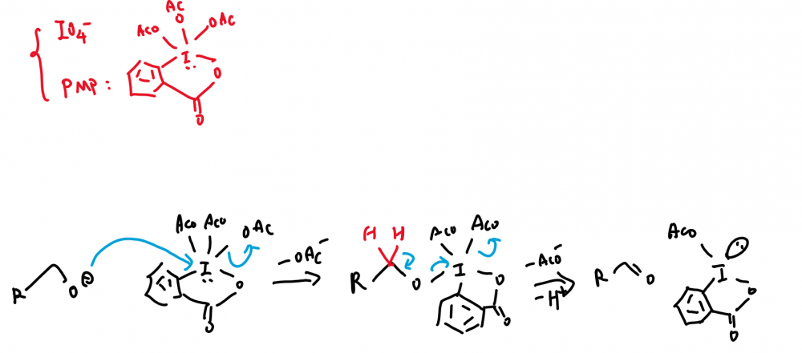

## 烯烃

空行的部分是我认为应该在烯烃词条中重点提及的，感觉在这边说意义不大，未来有可能补充上。

### 加水

#### 硫酸催化加水

#### 羟汞化（H与OH异侧）

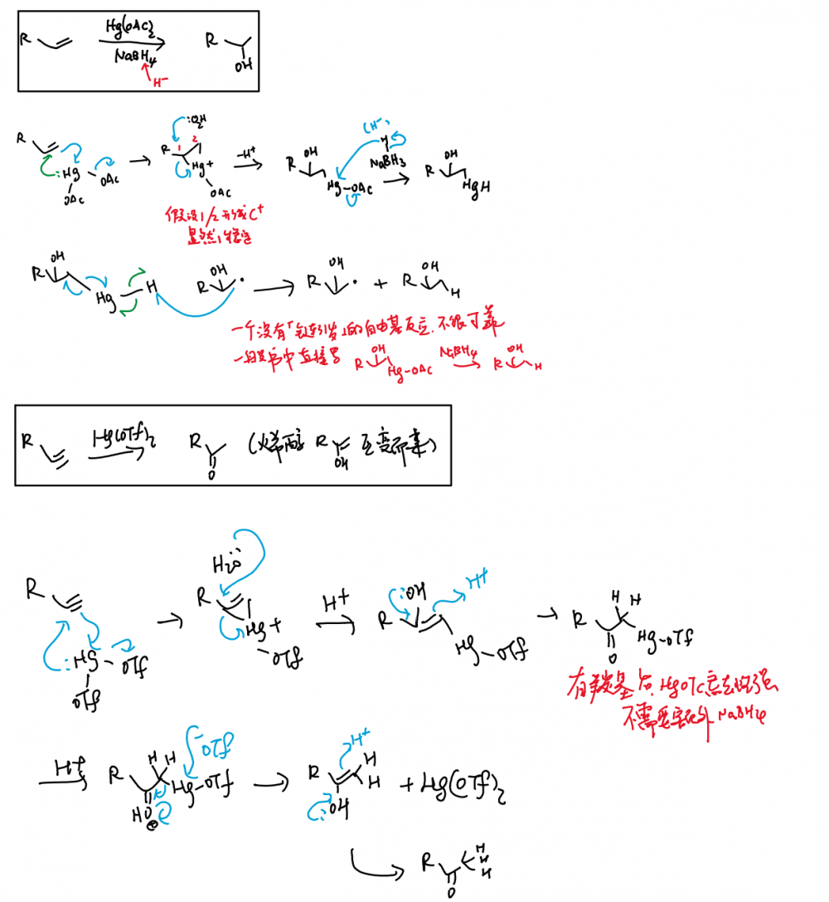

#### 硼氢化（H与OH同侧）

### 制备邻二醇

#### m-CPBA（顺式）

- 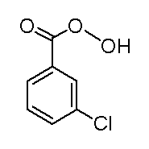

  m-CPBA：间氯代过氧苯甲酸

m-CPBA是一种过酸，相当于过氧化氢的升级版，用于提供过氧链。 （m-是meta-的缩写，表示间位）

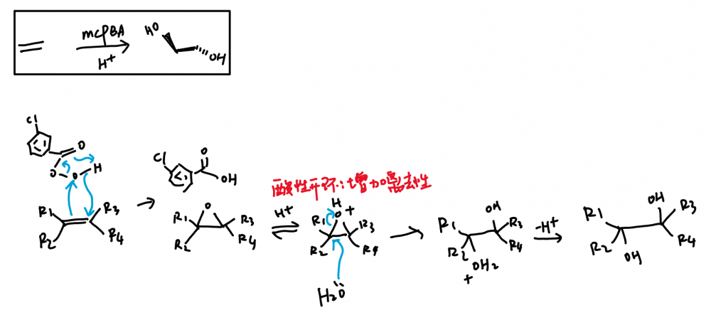

#### 四氧化锇/碱性高锰酸钾（反式）

**在这个反应中如果您使用了酸性高锰酸钾，特别是浓度过高，加热时，会如同烯烃臭氧化一样，发生碳链裂解。**

还原产物为锰酸钾或二氧化锰，机理中写成二氧化锰，锰酸钾可以视作高锰酸钾与二氧化锰在强碱中归中得到的。

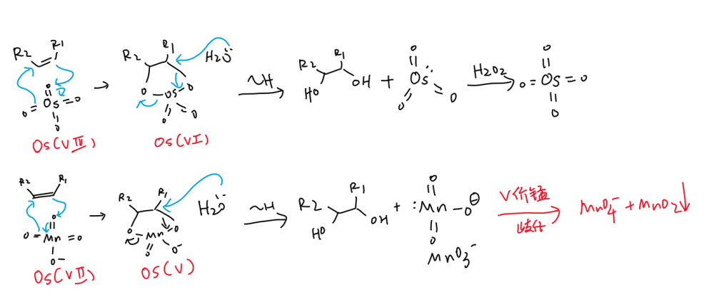

## 烯烃2

### 臭氧化（烯烃一步氧化到醛酮）

**臭氧化是一步将烯烃氧化为醛/酮的方法**，用高浓度的酸性高锰酸钾（或混了臭氧的高锰酸钾）也可以达到这个效果。

烯烃的臭氧化反应会将烯烃的双键打断，将整个碳链结构从双键处裂解。

### 高碘酸（邻二醇氧化到醛酮）

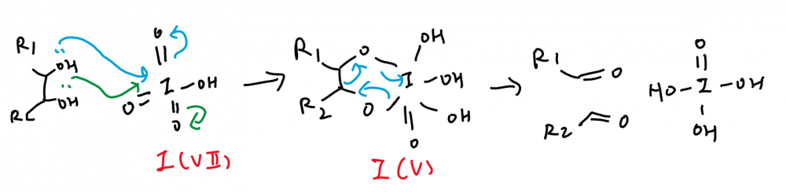

------

投稿地址：[http://wiki.lawaxi.net/index.php?title=有机:氧化反应](http://wiki.lawaxi.net/index.php?title=%E6%9C%89%E6%9C%BA:%E6%B0%A7%E5%8C%96%E5%8F%8D%E5%BA%94)

投稿日期：2020-06-21

收录日期：2020-08-03

引用本文：[1]Delay;Creator Chemical Lett.,2020,005.