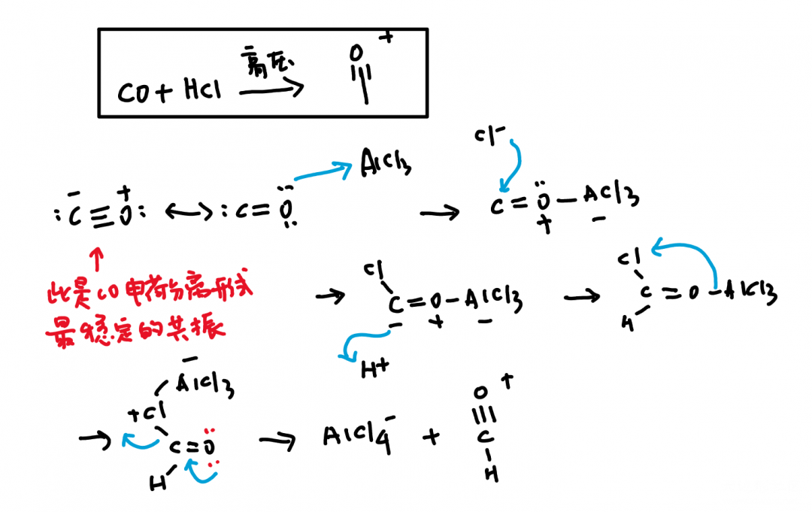
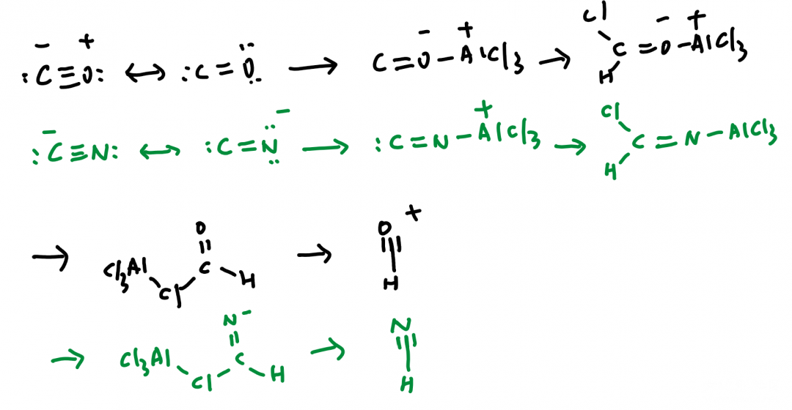
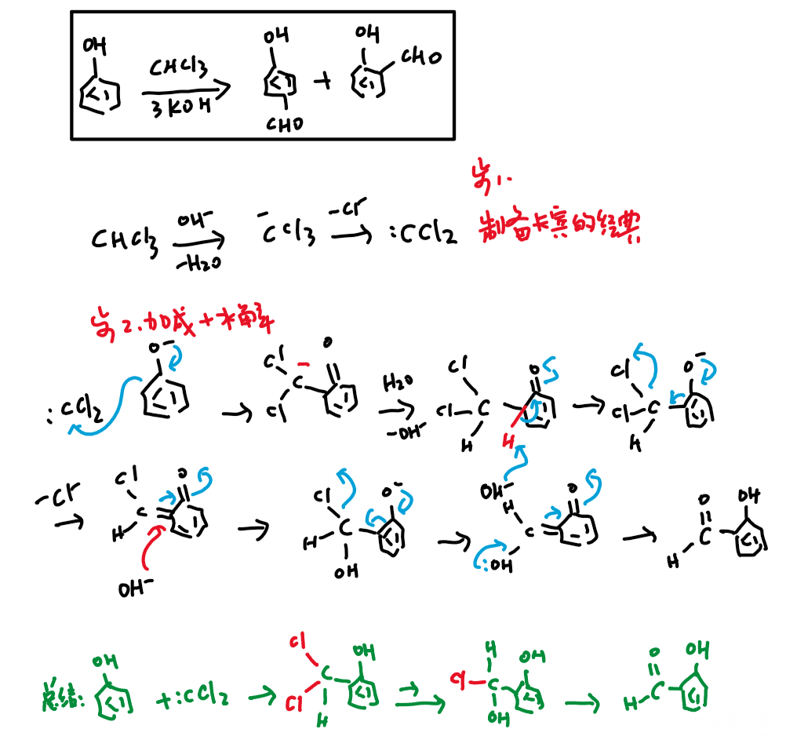

# 酰基化反应下：甲酰化反应

甲酰化反应是在苯环上添加甲醛基（CHO）的反应。

## Gatermann-Koch反应

CO+HCl+AlCl3+高压
变异版：Zn(CN)2+HCl+AlCl3

对于傅克反应，关键就在于产生酰基阳离子（所以后面的步骤就不画了）。对于甲酰化，由于没有“甲酰氯”的存在不能按照普通的傅克反应生产，而Gatermann-Koch反应就是对这个缺陷的一个修补，用CO和HCl在AlCl3环境下产生不稳定的甲酰阳离子。同样，《人名反应》上讲了一个变异：原理相同，但不需要气体和高压环境，应该更好一些。

## Vilsmeier-Haack反应

这个反应虽然看上去全然没有傅克反应的样子，但是其原理还是和傅克反应相同的，即生成一个亲电的阳离子，然后和苯环发生芳香亲电取代反应（加成和消除/水解）。

这个反应的Vilsmeier-Haack试剂比传统傅克的酰基阳离子位阻要大，因此在含有取代基的富电子苯环上反应时生成对位取代的概率要比邻位大得多。

## Reimer-Tiemann反应

这个反应一般不会放到酰基化反应下笼统来讲，因为不同于前面的，这个反应并不是基于傅克反应，或者原理上类似的。但是它同样是在苯环上添加甲醛基的良好反应。:CCl2是一个很好的卡宾，由于氯仿本身酸性很强，形成CCl3-后又发现C-又不如Cl-稳定，因此这是很经典的制备卡宾的反应。后续只是一个逐步的水解将Cl原子全部脱掉即可，写法不唯一，我选择了一个比较规整的写法。

------

投稿地址：http://www.lawaxi.net/d/114

投稿日期：2020-07-09

收录日期：2020-08-02

引用本文：[1]Delay;Creator Chemical Lett.,2020,007.