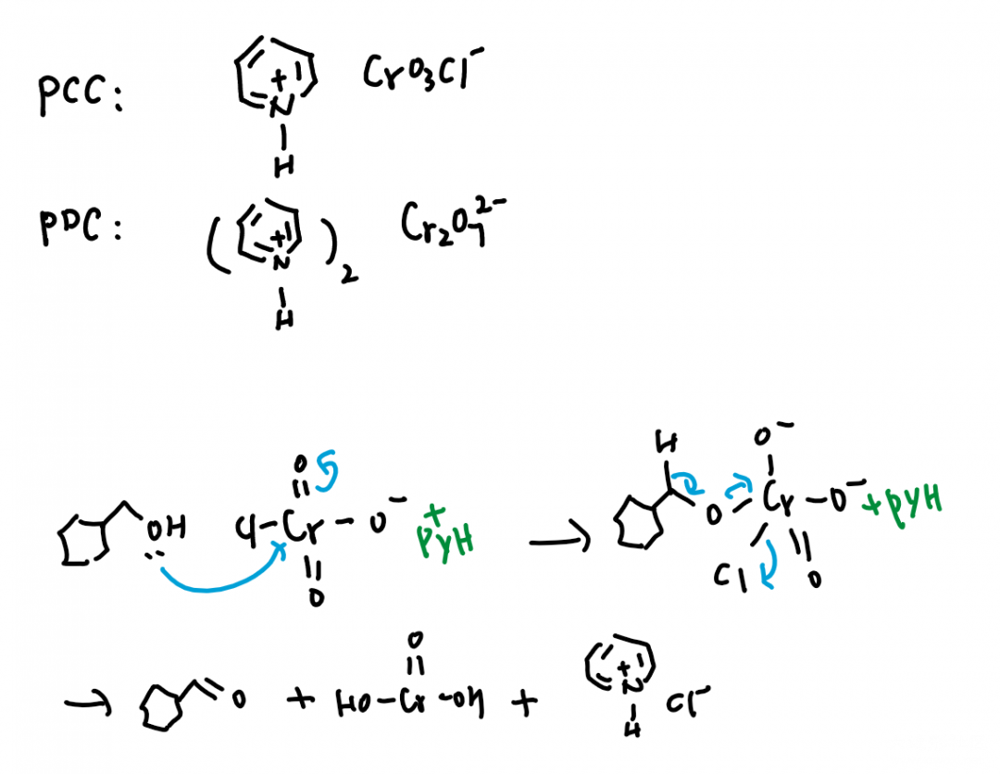

# Jones氧化，Sarett/Collin试剂，PCC，PDC

今天@化竞leon在发了一条朋友圈，有关Sarett试剂，这是什么东西呢？假如你之前在化学维基上看过我对有机化学中的氧化反应的总结词条，应当略知一二。但是那一次是在总结中提到了这个反应，并位细讲，而且并没有提及这个反应的发展变化。

## Jones氧化

Jones氧化是一个经典的氧化醇的反应，使用的试剂是酸性六价铬。这个反应的弊端有：

1. 一级醇会直接氧化为酸。原因：六价铬氧化性很强；这个反应是在水体系进行的，有足够的羟基来源。
2. 双键会被加成。原因：虽然双键加水是可逆的，但是酸催化了这一反应；而且生成的羟基又会发生Jones反应，拉动平衡。

大家都知道，在醇的氧化反应中，有一个奇迹般的反应就是灼热的铜丝，可以很神奇地将氧化控制到醛。这类反应实在很多，因此这个没有什么突出贡献的反应早就被有机化学家抛弃了。

机理的第一步实际上不同人有不同的画法；我觉得按照无机的观点分析，酸性下三氧化铬会生成铬酸（H2CrO4），因此第二章方法可能更妥当一些。

最后一步的思路如上图所示，生成了4价铬，《有机人名反应》上说它是绿色的。

## Jones氧化缺点的利用

大家不难看出，由于水和酸的存在，分子中的双键会被迅速加成上H和OH，然后OH再被氧化成醛/酮。这显然在一些合成时破坏了原本分子的结构，但有的时候也可以被利用，例如《有机人名反应》上举了一个Jones反应的例子（P305 Example3）。

这个反应经历了三次Jones氧化，因此我就不把Jones氧化的机理画出来了，就展示了它作为将羟基替换为双键氧的这一功能。

## Jones氧化缺点的改进：吡啶络合

有的人就很较真，可能觉得Jones的名字比较好听吗，就偏要把它变成可以选择性地氧化到醛的反应。不就是控制别让水加成上去变成酸吗，不就是控制一下六价铬的氧化性吗。于是：

1. CrO3的形式变为吡啶络合盐（CrO3·2Pyr）。络合增加稳定性，即降低六价铬氧化性。
2. Sarett和Collin分别是用吡啶和二氯甲烷作为溶剂。（这两个人名通常连起来成为Collin-Sarett试剂）

## Jones氧化缺点的改进：吡啶络合

我好困啊，赶快收尾吧。Collin-Sarett试剂又被改进为了这两种，它们是直接以离子的方式成盐了。当然机理相似，我就画比较简单的一种吧，画一下PCC，大家有画好PDC的记得留言。

后补：PDC机理画法

------

投稿地址：http://www.lawaxi.net/d/123

投稿日期：2020-07-15

收录日期：2020-08-02

引用本文：[1]Delay;Creator Chemical Lett.,2020,008.