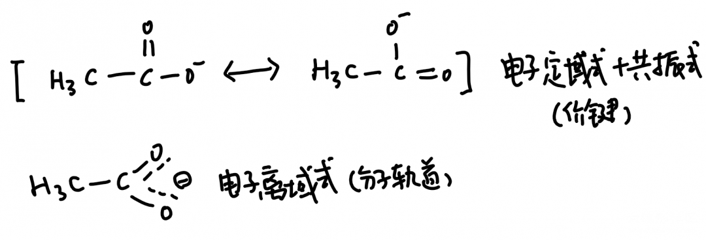

# 共振论 Resonance theory

## 产生

价键理论自诞生之初就强调电子的定域性，这个域指的是两个原子核间的位置。然而实际上分子中的电子应该是离域的：就拿最简单的甲烷举例子，四根键中的电子绝不是一成不变的，而是在整个分子中运动的。当共轭二烯中三根碳碳键等长，醋酸根中两根碳氧键等长这些问题摆在时人面前时，价键理论显的无能为力。

鲍林在1931-1933年间提出了共振论，用化学家熟悉的直观抽象方法，提出了这一问题的解决方法。由于价键理论的出发点就存在一些问题，因此用打补丁的方式实际上也不能解决全部问题，例如在涉及到立体化学，激发态等问题的时候就又解释不通了。因此研究含有复杂结构的有机化学时，通常使用的是从开始就由离域观点出发的分子轨道理论。

## 基本方法

1.共振式

上图是醋酸根的共振式，平均下来每根碳氧键的键级都是3/2，用于解释它们等价（等长）。一般来说，画共振式就是找出可以表达这一结构的多种定域式（经典结构式），要确保这些定域式的原子位置和成对电子数相同，只有电子的排布位置不通过。

2.共轭

我们同样可以用电子云的直观图来表示共振，在高中分析苯的π₆⁶大π键时就用到了这种方法，对于其他有共振结构的分子，同样不例外。注意，下图的共振式并不完整，只为了展示。

## 原则

1. 原子排布不变，配对电子数不变。

2. 定域式多的共振结构，对应的分子稳定，例如烯丙基，苄基的碳正离子和自由基。

## 贡献

在一个分子的众多共振结构中，根据各定域式稳定性的不同，分别对分子的真实结构有或多或少的贡献。我总结了下列原则。

1. 八隅体贡献大。
2. 无电负性差别的两个原子，不带形式电核比都带形式电核稳定。
3. 有电负性差别的两个原子，分别根据电负性带形式电核（电荷分离形式）比不带形式电核稳定。

------

投稿地址：http://www.lawaxi.net/d/129

投稿日期：2020-07-22

收录日期：2020-08-02

引用本文：[1]Delay;Creator Chemical Lett.,2020,009.