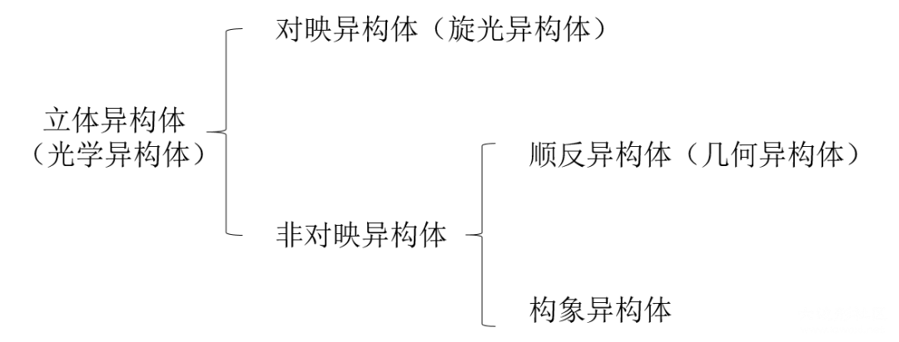
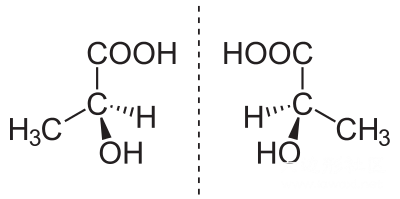
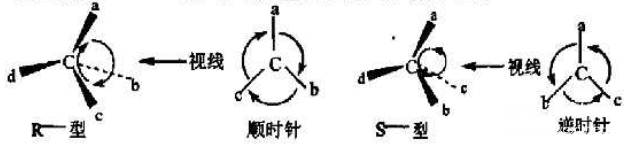

# 有机异构体 isomerism isomer

今天水一篇文章，梳理下有机物的几种异构体。
Isomerism is the relationship between isomers.

## 立体异构体 stereoisomerism stereoisomer

具有相同原子连接顺序，但原子的空间排列不同的同分异构体。

## 对映异构体 enantiomerism enantiomer

两个正好互为镜像的立体异构体/同分异构体。

## 非对映异构体 diastereomerism diastereomer

除去对映异构体外的所有立体异构体。有手性中心，但并不互为镜像的同分异构体。

## 顺反异构体 cis-trans isomerism cis-trans isomer

双键或环烃等阻碍分子自由旋转，基团相对参考面处于不同空间位置时的非对映异构体。

### 顺cis/反trans标记法

相同或相似基团在平面同侧时称为顺，不同测时称为反。基团全部不同时这种命名不适用。

### E/Z标记法（通常要求）

Z：~~zaiyiqi~~ zusammen 意为一起
E：entgegen 意为对面
根据次序规则（Cahn–Ingold–Prelog priority rules）排列优先级，优先级高的在同侧时为Z，反之E。

1. 依次比较链上每个原子，平局是比较下一个
2. 先比较中心原子原子序数，大者为优；原子序数相同时比较中心原子和周围原子分子量总和，大者为优
3. 若有双键或三键，计算分子量时计算两次或三次，例如CHO优先级大于CH₂OH

### 赤式erythro/苏式threo标记法

两个相邻手性碳上的取代基在Fischer投影式的同侧时，称为赤式；在异侧时，称为苏式。

### R/S标记法（似乎并不常用）

R：Rectus 意为右
S：Sinister 意为左
下图中，根据次序规则排列排列a>b>c>d，然后观察a→b→c的顺序，如果为顺时针则为R，逆时针为S。

## 构象异构体 conformational isomerism conformational isomer

和前面几种并不同，我觉得构象异构好像算不上是异构，因为构象异构描述的几乎是同一种分子，而这个分子通常也只能形成其中最稳的那种异构体。

### 碳链上的构象异构

交错式（staggered/anti）重叠式（eclipsed）间扭式（gauche）
Newman式中，交错越好越稳定，越重叠越不稳定。

### 环烷烃上的构象异构

椅式（chair）船式（boat）
椅式较为稳定，因为成键分为了平伏键（equitorial e键）和直立键（axial a键）两种，在Newman式中交错排列。

图片来源于wikipedia以及goldbook.

------

投稿地址：http://www.lawaxi.net/d/140

投稿日期：2020-08-03

收录日期：2020-08-03

引用本文：[1]Delay;Creator Chemical Lett.,2020,010.