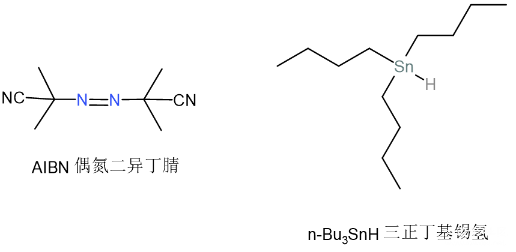
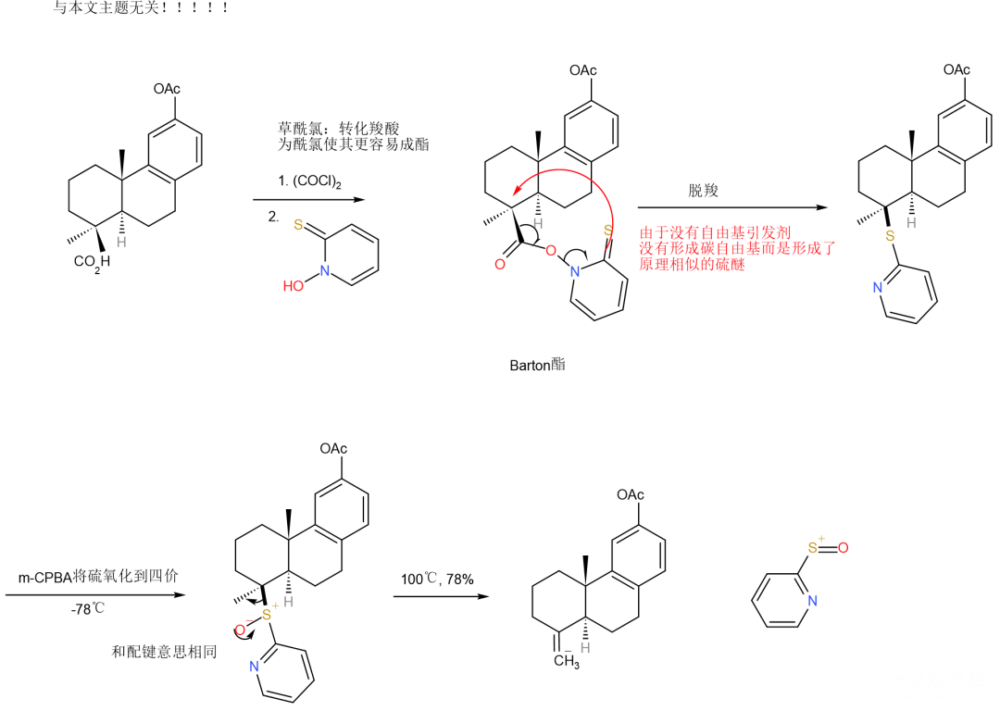
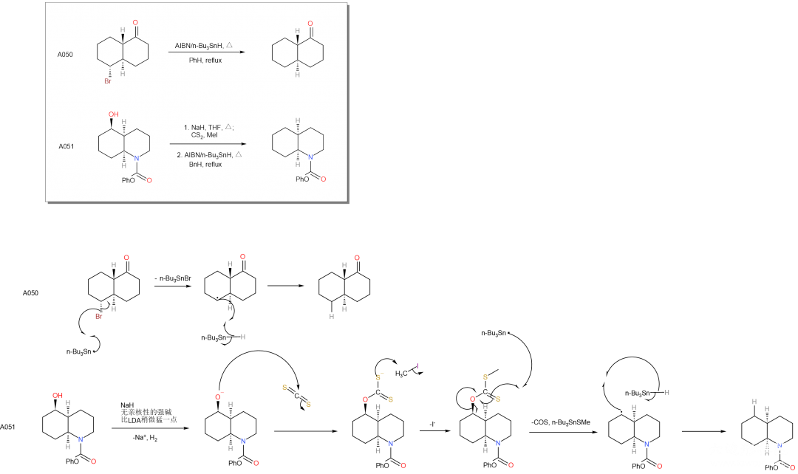

# 热引发自由基方法：n-Bu₃SnH/AIBN

注意，本文实际上并不像名字说的如此复杂，即使是学过高中有机也可以理解。

自由基反应是有机化学中常用的反应，实验中经常使用高活性的自由基引发反应。虽然自由基都是高活性的，但在自由基间也区分相对稳定性的大小。常见的自由基都需要光照才能生成，这使得很多自由基反应都是光化学反应，在实验室条件下很难完成；但也有一些自由基通过共轭或其他原因相对较为稳定，可以通过热引发，例如本文涉及的n-Bu₃SnH/AIBN，过硫酸铵等等。

这两种试剂是Barton反应最先提出的，本文介绍的“Barton radical decarboxylation”和“Barton–McCombie deoxygenation”两个反应，分别用来将羧基或羧基衍生物转变为氢原子，和将卤原子（其他离去性好的基团也可）转变为氢原子。下图是两个试剂的结构图。两点说明给初学者：有机化学中“/”通常表示“和”而不是“或”；偶氮表示非端基的氮氮双键。

## 自由基的产生

解释：
\1. 热引发AIBN均裂：AIBN均裂后生成的自由基连接了氰基，氰基中是碳氮三键，与自由基很好地共轭了，这就如同众所周知的烯丙基自由基稳定的道理一样。
\2. 由碳自由基转锡自由基：非金属（类非金属）的这些元素，周期越高电负性越低，即使是自由基也不愿意抢电子了；这个道理非常明显，锡基自由基是比任何碳自由基的稳定性不知道高到哪里去了的，实际上即使是硅自由基，都比碳自由基稳定许多。

到这里我们应该明白了，n-Bu₃SnH/AIBN这个混合试剂的作用实际上就是产生自由基（链引发），也就是自由基引发剂。

## Barton radical decarboxylation（Barton自由基脱羧反应）

解释：
\1. R基自由基的生成：诶，你不是说好的锡基自由基比碳自由基稳定得多多多多多吗，那怎么反应的呢；这个反应呀，他十分巧妙，虽然生成了不稳定的R自由基，但是还生成了十分十分十分稳定的芳香环，并且即使这个反应是可逆的，二氧化碳的溢出也能拉动反应。
\2. 生成R—H的同时生成了新的锡基自由基，形成了链传递。

《人名反应》在介绍这一反应的时候并没有隆重地介绍n-Bu₃SnH/AIBN的试剂，而是把它仅当作了这个反应的一个条件，强调了那个有邻位有双键硫的肟，举的例子也莫名其妙。下面的例子就是同样用那个肟，而将n-Bu₃SnH/AIBN换成了m-CPBA（氧化剂）后形成双键的反应，其实质竟然连自由基反应都不是。

## Barton–McCombie deoxygenation（Barton–McCombie去氧反应）

这个反应取名一点都没有体现反应的实质啊，虽然—OH变为—H效果上是去掉了一个氧，但若写成“去氧反应”倒容易让人以为氢也是原来分子的，只是发生了个重排然后把氧去掉了。但实质上并不是啊，你假如用n-Bu₃SnD显然就会发生—OH变成—D的反应呀。

这个反应和上一个反应机理类似，要点是：相比于第一个反应，叔丁基氢会有一些消耗，因此AIBN仍可以是催化剂量，叔丁基氢应当作反应物添加。

大家不要看到离去的那一大坨又是氧又是硫的就被吓到，实际上这个反应不止于此，换成像Br这样容易离去的基团也可以直接进行反应，如果是—OH则需要NaH（仅作为碱）和CS₂的作用转化为和上面示例一样的醚。所以说这个反应的应用还是可以很广泛的。下面举《福山机理》A050和A051两个正好是Br和OH的例子说明问题。

本文到此结束，大家有没有觉得这个试剂的神奇呢。另外，自由基反应因为都是均裂，所以断一次键要画两个单箭头，可以说是可以和周环反应比肩的画箭头最多的机理，大家有没有觉得机理画起来真的很好看呢。

------

投稿地址：http://www.lawaxi.net/d/146

投稿日期：2020-08-05

收录日期：2020-08-05

修改：2020-08-07

引用本文：[1]Delay;Creator Chemical Lett.,2020,011.