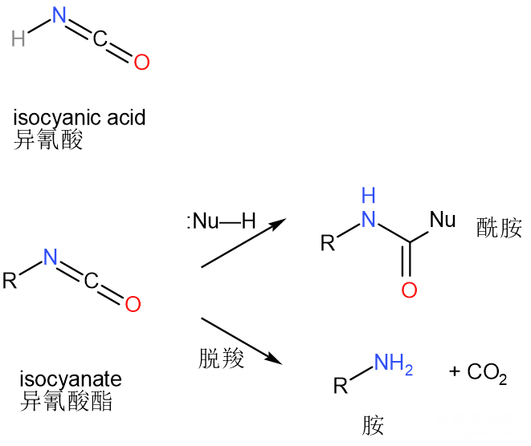
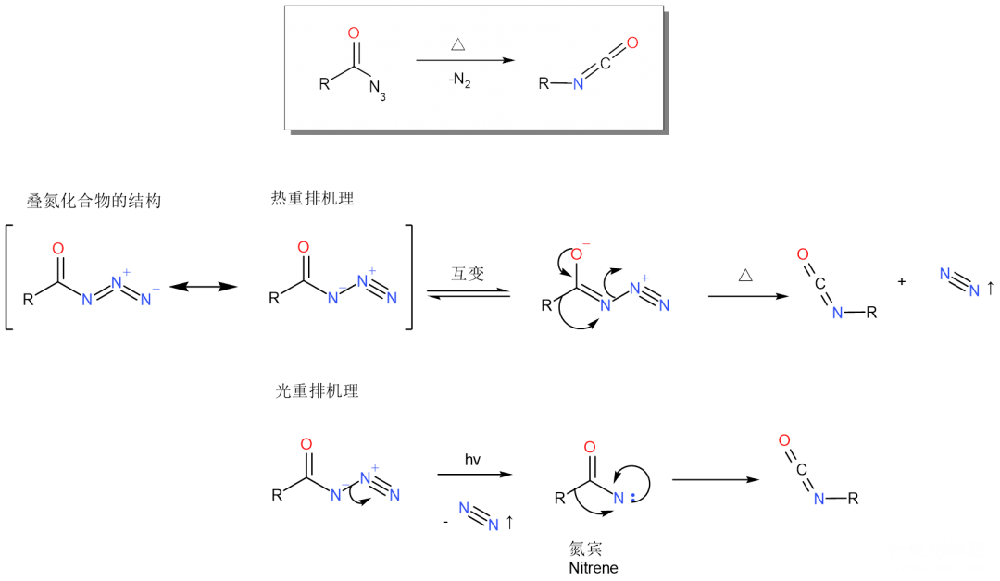
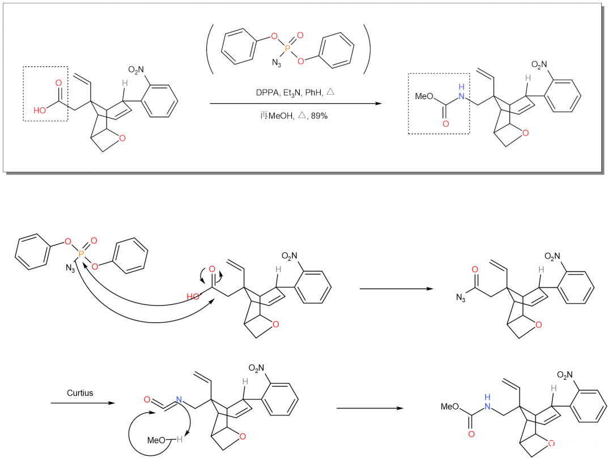
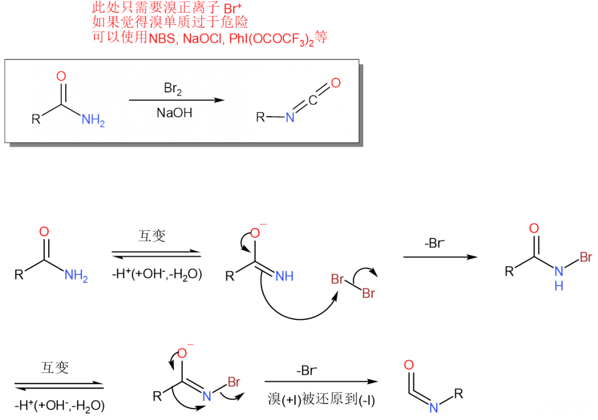
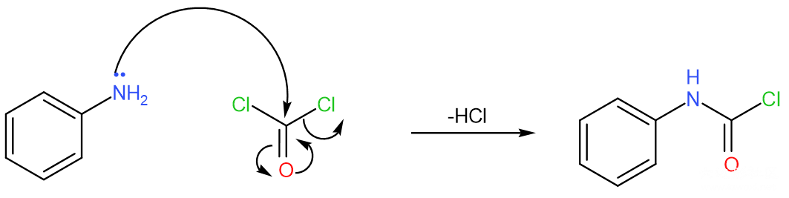
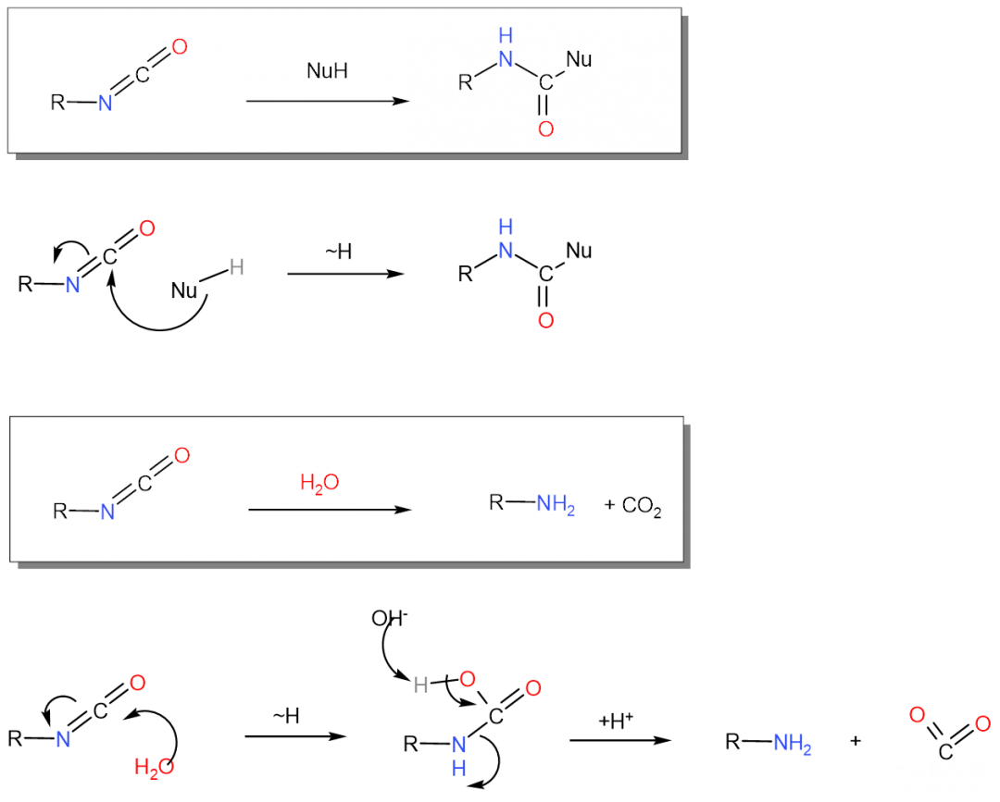

# 异氰酸酯 isocyanate

好少有人来看CCL啊，我只记得那苏点过一个赞。我最近写的很好理解了吧，不好理解的不是也有评论功能吗，我要哭了啊

今天聊一聊异氰酸酯相关的内容，大概会很不全面了。异氰酸酯指的是异氰酸（HNCO）上的氢被取代后的分子，中间的碳分别双键连着氮和氧，亲电性很强，因此异氰酸酯可以用于被Nu:进攻合成酰胺，或者水解脱羧制备胺。工业上用异氰酸酯主要用于制备脲，即被氨基进攻生成的。

制备1：Curtius重排反应（由叠氮化合物）

《人名反应》上介绍了，加热和光照下有不同的机理。

对于叠氮化合物的制备，一般来讲会使用卤代烃和叠氮化钠反应。如果您想用制得的异氰酸酯水解制备胺，显然从头就用水环境是好的；但如果您根本不想让制得的异氰酸酯水解掉，或者您的分子不能碰水，显然叠氮化钠在有机溶剂中的溶解度就不是很好了，《人名反应》Example1是一个用DPPA做叠氮源取代羟基的例子。

这个分子比较大，右边的一大坨我觉得大概和这反应没有什么关系，大家简写作R基吧。

制备2：Hofmann重排反应（由酰胺制备）

我们开头提到异氰酸酯的用途就是制备酰胺，或者制备胺。用酰胺反过来制备的异氰酸酯，显然不会再去制备酰胺，因此这个反应主要的用途是将酰胺转化为胺。

顺便提一下，图片中写的NBS（溴代琥珀酰亚胺）是很好用的提供正价溴的试剂，其原理是因为氮原子电负性很强，因此相连的溴通常会以Br⁺存在。另外，在工业上通常使用胺+光气（或三光气）的制备方法与Hofmann重排是异曲同工的，下面举一个简单的例子（只书写到了生成与Hofmann相同中间产物的一步）。

用途：制备胺，制备酰胺

制备&用途（异氰酸酯做中间体）：Bucherer-Bergs反应

异氰酸酯被亲核试剂进攻，可以合成酰胺，如果被氨（胺）进攻就会得到脲。Bucherer-Bergs巧妙地使用了这一特点，合成乙內酰脲。

------

投稿地址：http://www.lawaxi.net/d/148

投稿日期：2020-08-06

收录日期：2020-08-06

引用本文：[1]Delay;Creator Chemical Lett.,2020,012.