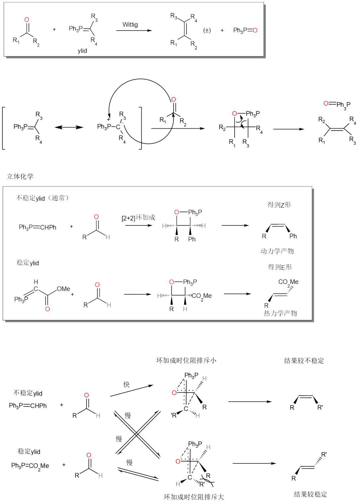
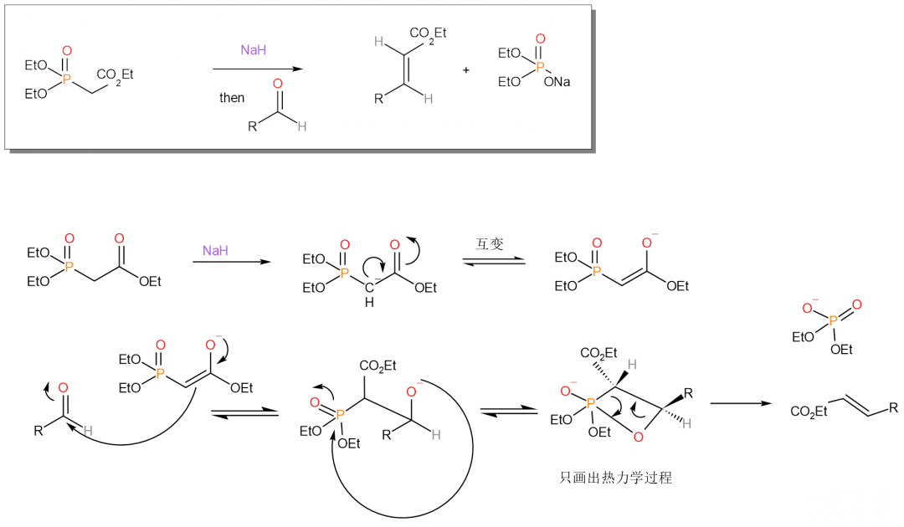
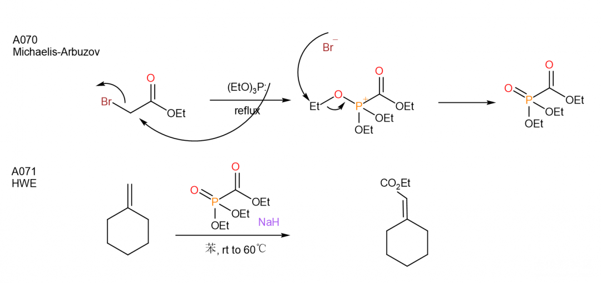
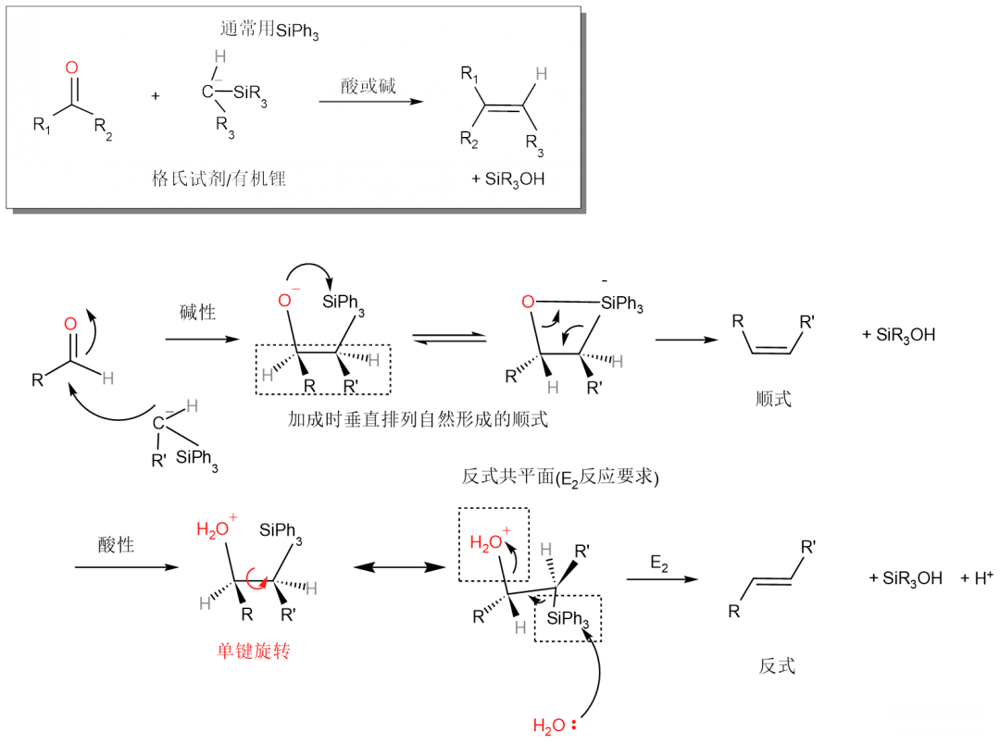
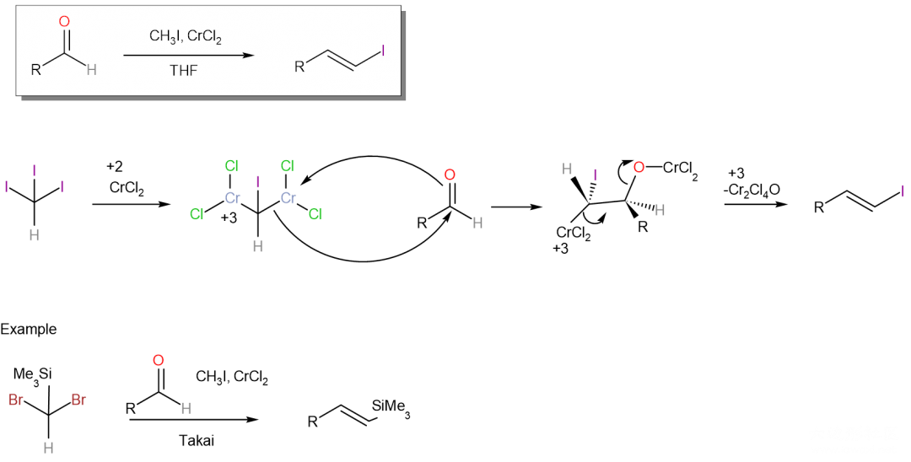
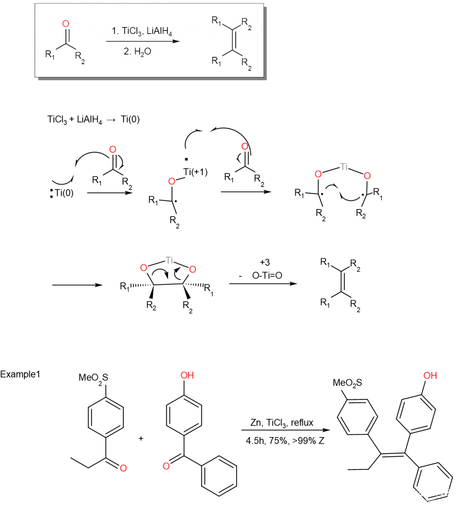

# Wittig反应等：将醛基转化为双键

Wittig反应

Wittig反应的要点是较稳定的ylid和较不稳定的ylid产物不同（α位有如羰基这样的基团稳定碳负离子的ylid是稳定的），大家可以对照着上图的内容与我形象的描述理解这一点。由于发生[2+2]环加成时，两个分子的HOMO和LUMO轨道分别是中心反对称和中心对称，因此使得这两个轨道必须垂直摆放才可以匹配。

垂直摆放时有两种路径可以选择，由于空阻，上面的路径速率更快，下面的路径速率更慢。对于不稳定的ylid，为了赶快让自己稳定下来，它会直接奔向速率最快的，也就是空间位阻较小的路径，生成的是动力学产物；我们能看到这样生成的产物并不是所有路线中最稳定的，但由于它很不稳定，不管怎么说都提高了稳定性，因此它也管不了这么多了。而对于稳定的ylid，它有充分的时间考虑自己往那边走，因为它本身比较稳定，不管是到空间位阻较小的一边还是较大的一边都差不多，因此最终得到的不稳定产物还会回到反应物，再次选择自己的路线，整个体系都在这全部的路线中反复横跳，但只要有分子生成了热力学稳定产物，这个分子就会停下来，最终大部分分子都转化为了热力学产物。

动力学产物指的就是速率较大的路径所生成的产物，热力学产物指的是得到的最稳定的产物；这两种产物通常是相同的，但像本反应中，就不相同。当反应物较不稳定时，它会为了提高稳定立刻走完速率最快的动力学路线；当反应物较稳定（相对于产物能量相差不大）的时候，它则会慢慢掂量，最终生成更稳定的热力学产物（当与酮反应时，两个产物都不很稳定，因此其实稳定的ylid和酮反应很慢或基本不反应的）。Wittig反应的优势就是在于这种立体选择性十分好。

Horner-Wadsworth-Emmons反应（HWE）

Horner反应中的试剂是对稳定的ylid的改良。这个反应用特定的磷酸酯替换了ylid，该反应除烯烃外的另一个生成物也从三苯基氧磷转化为了磷酸酯，可以水溶，让后处理更为方便。

上图是《福山机理》中给出的制备Horner试剂（用Michaelis-Arbnzov反应）和Horner反应本身的例子。

Peterson烯基化反应

这个反应和Wittig反应的原理很相似，同样使用了碳负离子做亲核试剂，同时选用硅替代磷，也是利用了这两种元素都亲氧的例子（Wittig中形成P=O和本反应中形成Si-OH都是各自的主要推动力。《人名反应》上说这个反应也被称为Si-Wittig反应。

这个反应相比于Wittig反应的优势之一在于生成的硅醇水溶性比三苯氧磷高，优势之二在于立体选择性更好调控（但实际上立体选择性的效果并不如Wittig）:本反应在酸性下生成反式产物，在碱性下生成顺式产物。这一特点可以清晰地通过机理展示：在碱性下通过四元环完成消除，在酸性下则通过E₂消除；四元环的消除机理要求氧与硅处于顺式，而E₂消除则要求它们必须处于反式共平面。

Takai反应

以上反应都利用了硅和磷亲氧的特点，但如果分子中本来就有硅和磷，这样的道路就行不通了。Takai反应使用二价铬做还原剂，在碘仿作用下可以使醛转化为E-烯基碘代物。将碘仿换成Me₃Si—CHBr₂，这个反应也可以发生。

McMurry偶联反应

McMurry偶联反应使用两个酮，被Ti(0)/Ti(+1)还原为烯烃。通常情况下由于反应都在一锅，这两个酮需要是相同的才能顺利完成反应，这样产生的烯烃是对称的；但《人名反应》Example1也给出了两个不相同的酮完成的反应，其中一个酮连有吸电子基团，因为自由基活性较弱无法与自己反应，而另一个酮有两个苯环占据空间，由于位阻的影响也无法与自己反应，十分巧妙。

------

投稿地址：http://www.lawaxi.net/d/151

投稿日期：2020-08-08

收录日期：2020-08-08

引用本文：[1]Delay;Creator Chemical Lett.,2020,013.