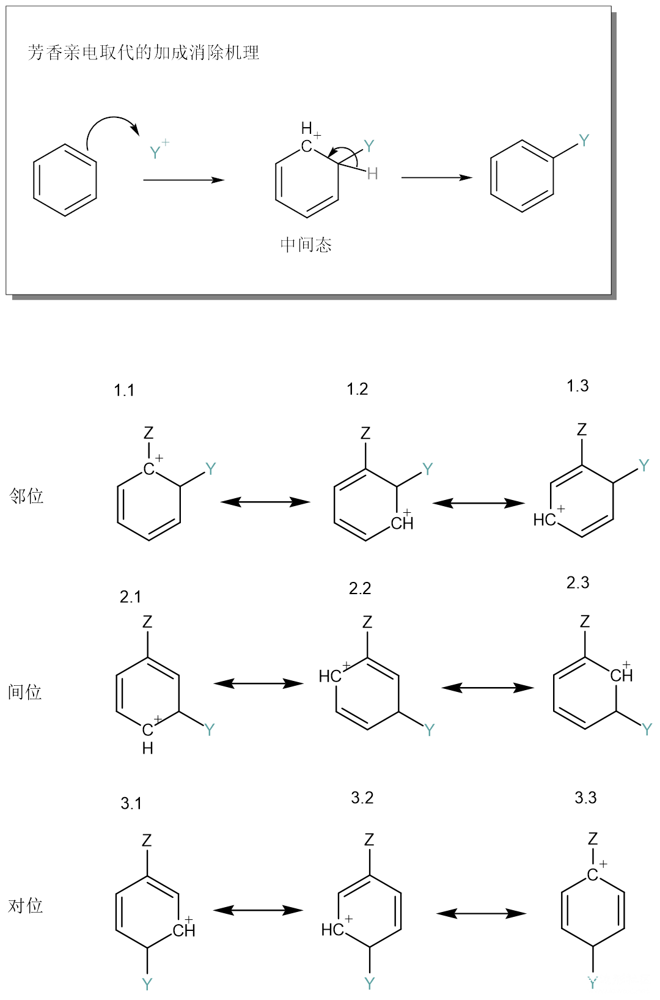
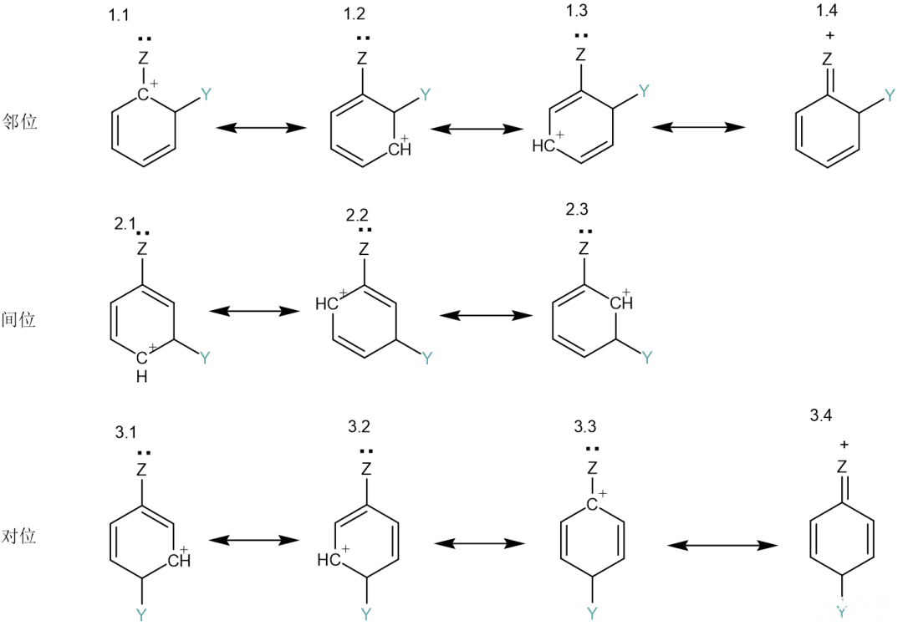
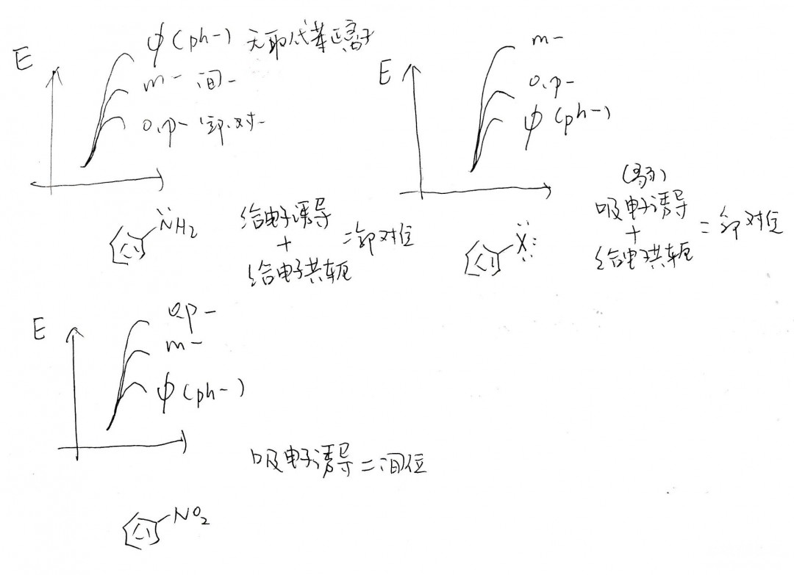

# 猴子都能看懂的：苯环上的定位效应

定位效应

当苯环上有取代基时，进攻不同位置发生亲电取代反应的速率，与亲电试剂无关，而由这些原有取代基决定，称为定位基。定位基大致分为邻对位定位基和间位定位基，单取代苯发生亲电取代反应的主要产物直接由定位基决定，多取代苯则由它们的共同作用决定。

诱导作用的影响：给电子与吸电子基，活化与钝化

本文重点讨论的定位效应，也就是判断那一条路径反应速率更快，归根结底是动力学上的判断。根据Hammond假设，速率的快慢取决于中间态的稳定性，中间态与反应物相差的能量（活化能）越低，则速率越快。本文讨论时，直接讨论哪个中间态稳定，读者就可以知道这条路是速率最快的路线了。

中间态的共振式如上图所示。抛开定位效应，给电子基和吸电子基对无论邻间对位都分别有活化和钝化的作用：

- 当Z为给电子基时，苯环上正电荷下降，因此比无取代苯正离子更稳定，均为活化基；
- 当Z为吸电子基时，苯环上正电荷增加，因此比无取代苯正离子更不稳定，均为钝化基。

相比于间位，邻位和对位都有一个共振式是正电荷在取代基本位上的（1.1与3.3），因此这个位置的活化和钝化作用都更加明显：

- 当Z为给电子基时，邻对位更加活化，稳定性上：邻对位>间位（>无取代苯正离子）；
- 当Z为吸电子基时，邻对位更加钝化，稳定性上：（无取代苯正离子>）间位>邻对位。

因此如果只考虑诱导效应，给电子基（活化基）是邻对位定位基，而吸电子基（钝化基）是间位定位基。

共轭效应的影响

然而实际情况虽与之相似，但却略有区别；间位定位基只有吸电子基（钝化基），而邻对位定位基有给电子基和吸电子基（活化基和钝化基）两种。例如卤原子，是吸电子基，也是邻对位定位基。能够产生定位效应的影响因素有两种，一种是上文提到的诱导效应，另一种则是取代基上的孤对电子产生的共轭效应。

当取代基上有孤对电子时，邻对位的中间态可以出现第四种共振式（1.4和3.4），即取代基的孤对电子成π键；这极大的提高了邻对位的稳定性，因而使带有孤对电子的取代基基本都是邻对位定位基。不仅是因为多了一个共振式而稳定，而是因为第四个共振式中，所有原子都处于八隅体状态，相比于其他共振式中碳正离子的六隅体状态，贡献更是很大的。苯基也是邻对位定位基，大概也可以理解为苯的π电子参与共轭。

卤素虽然是吸电子诱导作用，但卤素上的孤对电子也有共轭作用，这两种作用一弱一强，共同导致了卤素成为邻对位定位基。但要清楚的一点是，活化与钝化并不取决于孤对电子，只取决于给电子和吸电子；因此其他既有给电子诱导，又有孤对电子共轭的取代苯比无取代苯活性高，而卤苯则活性低。

综合

类似于卤原子，当诱导效应与共轭效应相反时，往往共轭效应会overpower诱导效应，综合来看大致有如下规律：

- 有孤对电子的，是邻对位定位基（OR，NH₂）；
- 没有孤对电子，是给电子基团的，是邻对位定位基（烷基）；
- 没有孤对电子，是吸电子基团的，是间位定位基（酰基，硝基，NR₃+ ）。

当一个苯上有多个定位基时，会按照定位基强若决定主要产物，强弱大致如下：

- 邻对位定位基：NR₂>NHR>NH₂>OH>NHCOR>OR>OCOR>R>Ar>X
- 间位定位基：NR₃+ >NO₂>CF₃>CCl₃>CN>SO₃H>COH>COR>COOH>COOR

注：SH取代的时候亲电试剂会进攻S原子而非苯环。

------

投稿地址：http://www.lawaxi.net/d/152

投稿日期：2020-08-11

收录日期：2020-09-13

引用本文：[1]Delay;Creator Chemical Lett.,2020,014.